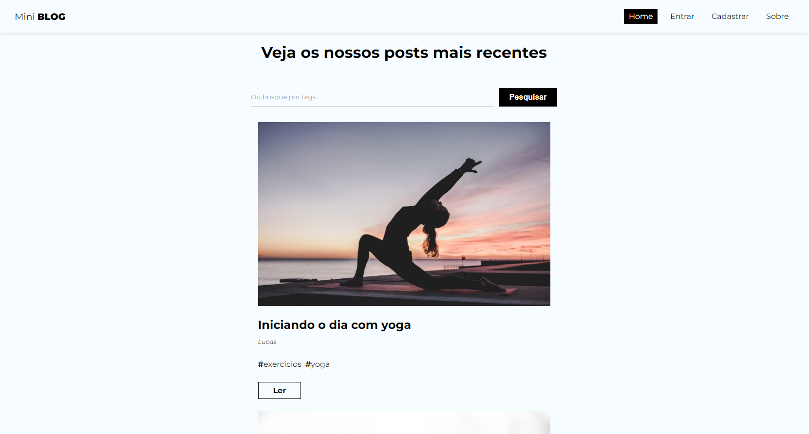

<h1 align="center">Mini Blog</h1>

O projeto foi desenvolvido durante o curso [React do zero a maestria](https://www.udemy.com/course/react-do-zero-a-maestria-c-hooks-router-api-projetos/) do [Matheus Battisti](https://www.youtube.com/@MatheusBattisti).

### Objetivo

O objetivo foi criar um blog que seria possível fazer um CRUD completo com a criação de usuários e posts, fazer a autenticação do usuário e o controle de sessão e fazer o gerenciamento das postagens podendo editar e excluir. Tudo isso integrado com o Firebase que ficou responsável pelo servidor e o armazenamento dos dados.

### 🔗 Links

- URL do site no ar: [Clique aqui!](https://mini-blog-kohl.vercel.app/)

### 🛠 Tecnologias

As seguintes ferramentas foram usadas na construção do projeto:

- React
- HTML
- CSS
- JavaScript
- Firebase

### Autor
---

Feito por Matheus Cardoso Morais 👋🏽 Entre em contato!

 

